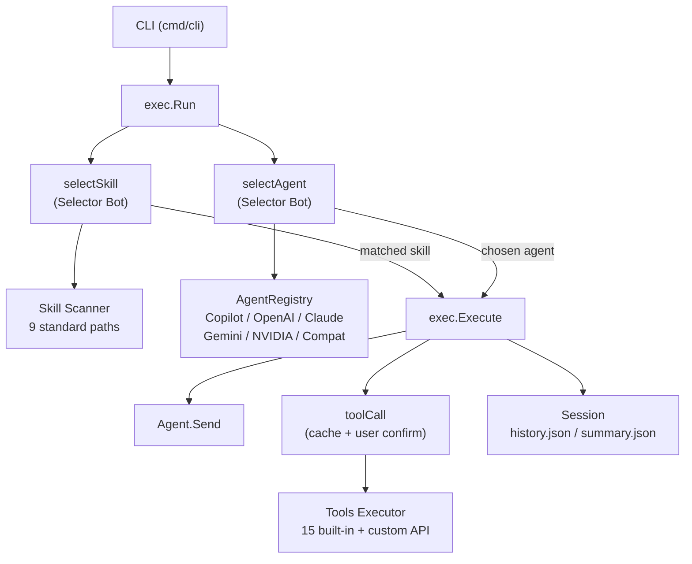

> [!NOTE]
> This README was generated by [SKILL](https://github.com/pardnchiu/skill-readme-generate), get the ZH version from [here](./doc/README.zh.md).


# go-agent-skills

[](https://pkg.go.dev/github.com/pardnchiu/go-agent-skills)
[](https://goreportcard.com/report/github.com/pardnchiu/go-agent-skills)
[](LICENSE)
[](https://github.com/pardnchiu/go-agent-skills/releases)

> A Go agentic framework with summary memory, a dual-layer routing execution engine, and zero-code API tool mounting

## Table of Contents

- [Features](#features)
- [Architecture](#architecture)
- [File Structure](#file-structure)
- [License](#license)
- [Author](#author)
- [Stars](#stars)

## Features

> `go install github.com/pardnchiu/go-agent-skills/cmd/cli@latest` · [Documentation](./doc/doc.md)

### Cross-Turn Summary Memory

At the end of each turn, the framework uses the LLM to compress the full conversation into a structured `summary.json`. On the next turn, the summary and recent messages are automatically injected, giving the agent cross-turn memory without exceeding the context window. The agent can also actively call the `search_history` tool to query past conversations by keyword and time range, rather than relying passively on the summary alone.

### Zero-Code API Tool Mounting

The framework ships 15 built-in tools covering file I/O, web search, JS-rendered browser fetching, Yahoo Finance, Google News RSS, weather, precision math, and shell commands. Beyond that, the `apiAdapter` layer lets any REST API be mounted as a new tool by dropping a single JSON config file — no framework code changes required. Authentication (Bearer Token, API Key, Basic Auth), request format, timeout, and response parsing are all declared in the config file, and the agent calls the tool directly.

### Dual-Layer Routing Agentic Execution Engine

Before execution, a lightweight Selector Bot performs two LLM routing decisions simultaneously: it selects the best matching Skill from a concurrently-scanned list across 9 standard paths, and picks the most suitable backend from the Agent Registry. The execution loop iterates up to 8 times (general mode) or 128 times (Skill mode), caches every tool call result to avoid redundant requests, and automatically triggers a summarization pass when the iteration limit is reached — returning a coherent final response instead of an error.

## Architecture



## File Structure

```
go-agent-skills/
├── cmd/
│   └── cli/
│       ├── main.go                  # CLI entry point
│       ├── getAgentRegistry.go      # Multi-provider Agent Registry init
│       ├── printTool.go             # ANSI color output helpers
│       └── runEvents.go             # Event loop and interactive confirm
├── internal/
│   ├── agents/
│   │   ├── exec/                    # Execution core (routing, tool loop, session management)
│   │   │   ├── execute.go           # Main execution loop (up to 8/128 tool iterations)
│   │   │   ├── run.go               # Top-level entry, wires Skill/Agent selection
│   │   │   ├── selectAgent.go       # LLM-driven agent routing
│   │   │   ├── selectSkill.go       # LLM-driven skill matching
│   │   │   ├── toolCall.go          # Tool invocation, caching, user confirmation
│   │   │   ├── getSession.go        # Session init with flock concurrency guard
│   │   │   └── prompt/              # Embedded system prompts (Go embed)
│   │   ├── provider/                # 6 AI backend implementations
│   │   │   ├── copilot/             # GitHub Copilot (Device Code login)
│   │   │   ├── openai/              # OpenAI API
│   │   │   ├── claude/              # Anthropic Claude API
│   │   │   ├── gemini/              # Google Gemini API
│   │   │   ├── nvidia/              # NVIDIA NIM API
│   │   │   └── compat/              # Any OpenAI-compatible endpoint (Ollama, etc.)
│   │   └── types/                   # Shared types (Agent, Message, Output, etc.)
│   ├── skill/                       # Concurrent skill scanning and parsing
│   ├── tools/                       # Tool executor and 15 built-in tools
│   │   ├── executor.go              # Tool dispatch and Unicode arg normalization
│   │   ├── apiAdapter/              # JSON-config-driven custom API tools
│   │   ├── apis/                    # Network APIs (Finance, RSS, Weather)
│   │   ├── browser/                 # Chrome JS-rendered page extraction
│   │   ├── calculator/              # big.Int precision math
│   │   └── file/                    # File read/write, search, history query
│   └── utils/                       # HTTP utilities
├── examples/apis/                   # Sample custom API configs
├── go.mod
└── README.md
```

## License

This project is licensed under the [MIT LICENSE](LICENSE).

## Author


<h4 style="padding-top: 0">邱敬幃 Pardn Chiu</h4>

<a href="mailto:dev@pardn.io" target="_blank">

</a> <a href="https://linkedin.com/in/pardnchiu" target="_blank">

</a>

## Stars

[](https://www.star-history.com/#pardnchiu/go-agent-skills&Date)

***

©️ 2026 [邱敬幃 Pardn Chiu](https://linkedin.com/in/pardnchiu)
