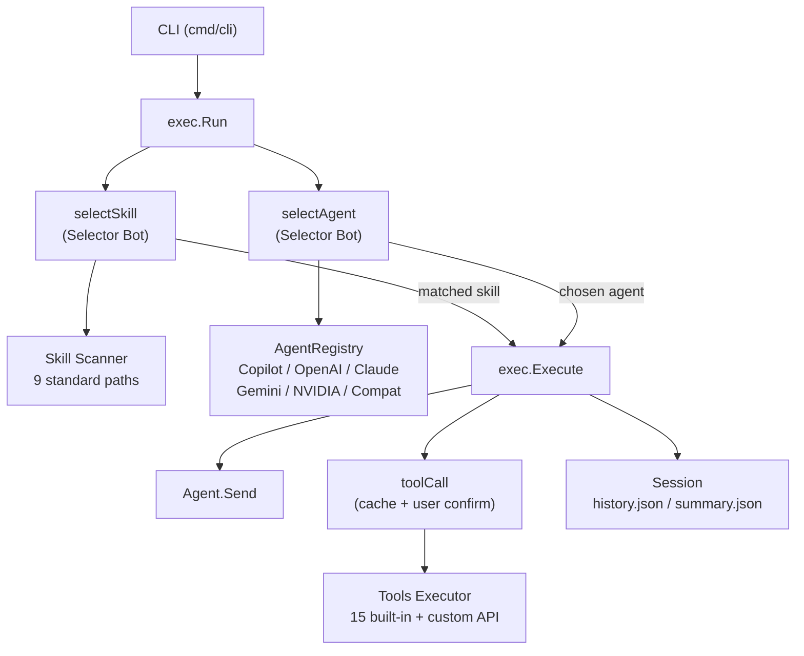

> [!NOTE]
> This README was generated by [SKILL](https://github.com/pardnchiu/skill-readme-generate), get the ZH version from [here](./doc/README.zh.md).


# Agenvoy

[](https://pkg.go.dev/github.com/pardnchiu/agenvoy)
[](https://goreportcard.com/report/github.com/pardnchiu/agenvoy)
[](https://app.codecov.io/github/pardnchiu/agenvoy/tree/master)
[](LICENSE)
[](https://github.com/pardnchiu/agenvoy/releases)

> A Go-based agentic AI platform with intent-to-skill routing, multi-provider LLM dispatch, cross-turn memory, and zero-code REST API tool mounting.

## Table of Contents

- [Features](#features)
- [Architecture](#architecture)
- [File Structure](#file-structure)
- [License](#license)
- [Author](#author)
- [Stars](#stars)

## Features

> `go install github.com/pardnchiu/agenvoy/cmd/cli@latest` · [Documentation](./doc/doc.md)

### Dual-Layer Routing Agentic Execution Engine

Before each execution, a lightweight Selector Bot runs two concurrent LLM routing decisions: it matches the best Skill from markdown files scanned across 9 standard paths, and picks the most suitable backend from the Agent Registry. The execution loop runs up to 16 iterations (general mode) or 128 iterations (Skill mode), deduplicates cached tool calls, and automatically triggers a summarization pass when the iteration limit is reached — always returning a coherent final response.

### Zero-Code REST API Tool Mounting

The framework ships 15 built-in tools covering file I/O, web search, JS-rendered browser fetching, financial data, weather, precision math, and shell commands. Beyond these, any REST API can be mounted as a new tool by dropping a single JSON config file into the standard paths — no framework code changes required. Authentication (Bearer Token, API Key, Basic Auth), request format, timeout, and response field mapping are all declared in the config.

### OS Keychain Credential Storage with Safe Command Execution

API keys are stored in the OS-native keychain (macOS Keychain via `security`, Linux via `secret-tool`) rather than environment variables, with a file-based fallback for other platforms. The `rm` command is intercepted and redirected to a `.Trash` directory instead of permanently deleting files, preventing accidental data loss during AI-driven file operations.

## Architecture



## File Structure

```
agenvoy/
├── cmd/
│   └── cli/
│       ├── main.go                  # CLI entry point
│       ├── addProvider.go           # Interactive provider setup
│       ├── getAgentRegistry.go      # Multi-provider Agent Registry init
│       ├── printTool.go             # ANSI color output helpers
│       └── runEvents.go             # Event loop and interactive confirm
├── internal/
│   ├── agents/
│   │   ├── exec/                    # Execution core (routing, tool loop, session management)
│   │   ├── provider/                # 6 AI backends (copilot/openai/claude/gemini/nvidia/compat)
│   │   └── types/                   # Shared interfaces (Agent, Message, Output)
│   ├── discord/                     # Optional Discord bot integration
│   ├── keychain/                    # OS keychain credential storage
│   ├── skill/                       # Concurrent skill scanning and parsing
│   ├── tools/                       # Tool executor and 15 built-in tools
│   │   ├── apiAdapter/              # JSON-config-driven custom API tools
│   │   ├── apis/                    # Network APIs (Finance, RSS, Weather)
│   │   ├── browser/                 # Chrome JS-rendered page extraction
│   │   ├── calculator/              # Precision math
│   │   └── file/                    # File read/write, search, history query
│   └── utils/                       # Shared utilities
├── examples/apis/                   # Sample custom API configs
├── go.mod
└── README.md
```

## License

This project is licensed under the [AGPL-3.0 LICENSE](LICENSE).

## Author


<h4 style="padding-top: 0">邱敬幃 Pardn Chiu</h4>

<a href="mailto:dev@pardn.io" target="_blank">

</a> <a href="https://linkedin.com/in/pardnchiu" target="_blank">

</a>

## Stars

[](https://www.star-history.com/#pardnchiu/agenvoy&Date)

***

©️ 2026 [邱敬幃 Pardn Chiu](https://linkedin.com/in/pardnchiu)
