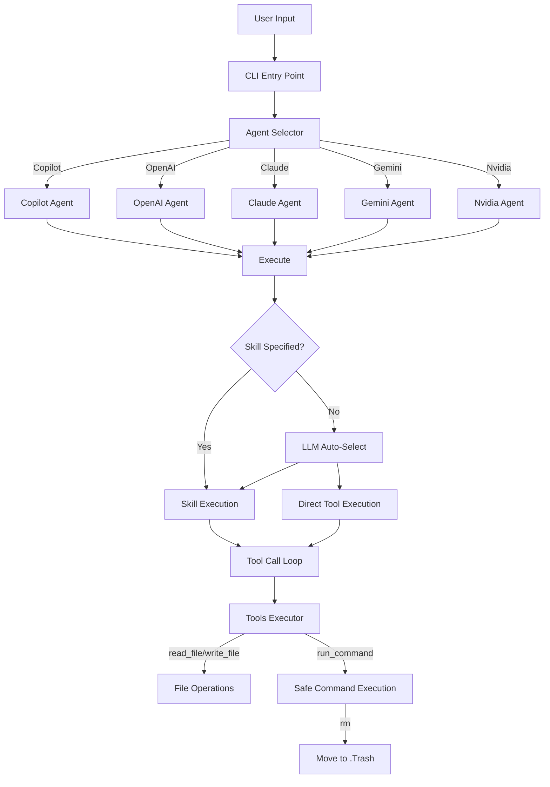

> [!NOTE]
> This README was generated by [SKILL](https://github.com/pardnchiu/skill-readme-generate), get the ZH version from [here](./README.zh.md).

# go-agent-skills

[](https://pkg.go.dev/github.com/pardnchiu/go-agent-skills)
[](LICENSE)

> Unified Skill execution engine for multiple AI agents, supporting GitHub Copilot, OpenAI, Claude, Gemini, and Nvidia

## Table of Contents 

- [Features](#features)
- [Architecture](#architecture)
- [File Structure](#file-structure)
- [License](#license)
- [Author](#author)
- [Stars](#stars)

## Features

> `go install github.com/pardnchiu/go-agent-skills/cmd/cli@latest` · [Documentation](./doc.md)

### Unified Agent Interface for Five AI Backends

Integrates GitHub Copilot, OpenAI, Claude, Gemini, and Nvidia through a single `Agent` interface, eliminating the need to rewrite integration logic for each API. Whether it's Copilot's Device Code authentication or API Key validation for other platforms, all are handled by their respective Agent implementations. Consumers only need to use the unified `Send()` and `Execute()` methods.

### Safe Command Execution

Built-in `rm` command interception automatically moves files to `.Trash` directory instead of permanent deletion, preventing LLM from accidentally removing critical files. All dangerous commands require whitelist validation and support interactive confirmation (can be skipped with `--allow` flag). Execution is transparent with all tool calls and arguments printed for user review before execution.

### Intelligent Skill Auto-Matching

When users don't explicitly specify a Skill name, the system uses LLM to automatically select the most relevant Skill from installed options. If no suitable Skill is found, it falls back to direct tool execution mode, eliminating manual Skill or tool specification.

## Architecture



## File Structure

```
go-agent-skills/
├── cmd/
│   └── cli/
│       └── main.go              # CLI entry point, handles list/run commands
├── internal/
│   ├── agents/                  # Agent implementations
│   │   ├── exec.go              # Unified execution logic and Skill auto-matching
│   │   ├── copilot/             # GitHub Copilot (Device Code auth)
│   │   ├── openai/              # OpenAI API
│   │   ├── claude/              # Anthropic Claude API
│   │   ├── gemini/              # Google Gemini API
│   │   └── nvidia/              # Nvidia API
│   ├── skill/                   # Skill scanning and parsing
│   │   ├── scanner.go           # Concurrent multi-path SKILL.md scanner
│   │   └── parser.go            # Parse SKILL.md metadata
│   └── tools/                   # Tool executor
│       ├── executor.go          # Tool definitions and execution entry
│       ├── file.go              # read_file/write_file/list_files
│       └── tools.go             # run_command (with whitelist and rm interception)
├── go.mod
├── LICENSE
└── README.md
```

## License

This project is licensed under the [MIT LICENSE](LICENSE).

## Author


<h4 style="padding-top: 0">邱敬幃 Pardn Chiu</h4>

<a href="mailto:dev@pardn.io" target="_blank">

</a> <a href="https://linkedin.com/in/pardnchiu" target="_blank">

</a>

## Stars

[](https://www.star-history.com/#pardnchiu/go-agent-skills&Date)

***

©️ 2026 [邱敬幃 Pardn Chiu](https://linkedin.com/in/pardnchiu)
