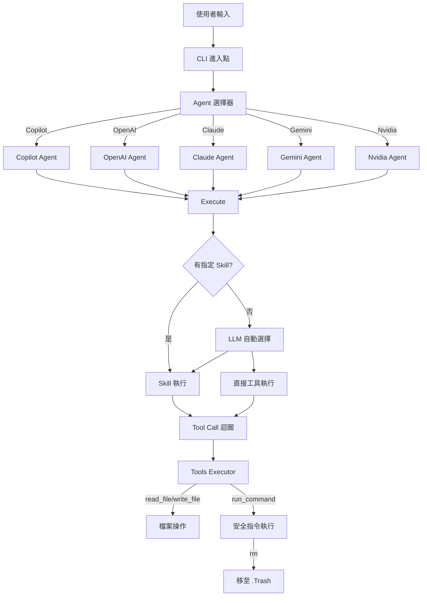

> [!NOTE]
> 此 README 由 [SKILL](https://github.com/pardnchiu/skill-readme-generate) 生成，英文版請參閱 [這裡](./README.md)。

# go-agent-skills

[](https://pkg.go.dev/github.com/pardnchiu/go-agent-skills)
[](LICENSE)

> 統一多家 AI Agent 介面的 Skill 執行引擎，支援 GitHub Copilot、OpenAI、Claude、Gemini 與 Nvidia

## 目錄

- [功能特點](#功能特點)
- [架構](#架構)
- [檔案結構](#檔案結構)
- [授權](#授權)
- [Author](#author)
- [Stars](#stars)

## 功能特點

> `go install github.com/pardnchiu/go-agent-skills/cmd/cli@latest` · [完整文件](./doc.zh.md)

### 整合多種雲端模型的 Agent 介面

提供單一 `Agent` 介面，可同時整合 GitHub Copilot、OpenAI、Claude、Gemini 與 Nvidia 等主流雲端 AI 模型。開發者無需分別適配各家 API，所有雲端模型的接入邏輯與認證（如 Copilot 的 Device Code、或 API Key 驗證）皆於 Agent 層統一處理，使用統一的 `Send()` 及 `Execute()` 方法即可存取多種雲端 AI 算法。

### 安全的指令執行機制

內建 `rm` 指令攔截並自動移至 `.Trash` 目錄，避免 LLM 誤刪關鍵檔案。所有危險指令皆需通過白名單驗證，並支援互動式確認機制（`--allow` 旗標可跳過）。執行過程透明化，所有工具呼叫前都會印出參數供使用者檢視。

### 智能 Skill 自動匹配

當使用者未明確指定 Skill 名稱時，系統透過 LLM 自動從已安裝的 Skill 清單中選擇最符合需求的 Skill。若無適配 Skill，則退回至直接使用工具模式執行任務，無需手動指定工具或 Skill。

## 架構



## 檔案結構

```
go-agent-skills/
├── cmd/
│   └── cli/
│       └── main.go              # CLI 進入點，處理 list/run 指令
├── internal/
│   ├── agents/                  # Agent 實作
│   │   ├── exec.go              # 統一執行邏輯與 Skill 自動匹配
│   │   ├── copilot/             # GitHub Copilot（Device Code 登入）
│   │   ├── openai/              # OpenAI API
│   │   ├── claude/              # Anthropic Claude API
│   │   ├── gemini/              # Google Gemini API
│   │   └── nvidia/              # Nvidia API
│   ├── skill/                   # Skill 掃描與解析
│   │   ├── scanner.go           # 並行掃描多路徑 SKILL.md
│   │   └── parser.go            # 解析 SKILL.md 中的 metadata
│   └── tools/                   # 工具執行器
│       ├── executor.go          # Tool 定義與執行入口
│       ├── file.go              # read_file/write_file/list_files
│       └── tools.go             # run_command（含白名單與 rm 攔截）
├── go.mod
├── LICENSE
└── README.md
```

## 授權

本專案採用 [MIT LICENSE](LICENSE)。

## Author


<h4 style="padding-top: 0">邱敬幃 Pardn Chiu</h4>

<a href="mailto:dev@pardn.io" target="_blank">

</a> <a href="https://linkedin.com/in/pardnchiu" target="_blank">

</a>

## Stars

[](https://www.star-history.com/#pardnchiu/go-agent-skills&Date)

***

©️ 2026 [邱敬幃 Pardn Chiu](https://linkedin.com/in/pardnchiu)
