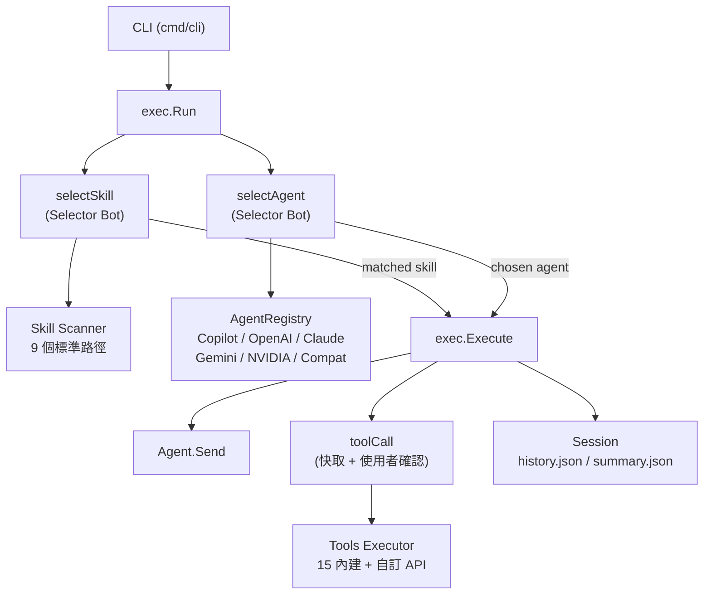

> [!NOTE]
> 此 README 由 [SKILL](https://github.com/pardnchiu/skill-readme-generate) 生成，英文版請參閱 [這裡](../README.md)。


# go-agent-skills

[](https://pkg.go.dev/github.com/pardnchiu/go-agent-skills)
[](https://goreportcard.com/report/github.com/pardnchiu/go-agent-skills)
[](LICENSE)
[](https://github.com/pardnchiu/go-agent-skills/releases)

> 具備概要記憶、雙層路由執行引擎與零程式碼 API 工具掛載的 Go Agentic 框架

## 目錄

- [功能特點](#功能特點)
- [架構](#架構)
- [檔案結構](#檔案結構)
- [授權](#授權)
- [Author](#author)
- [Stars](#stars)

## 功能特點

> `go install github.com/pardnchiu/go-agent-skills/cmd/cli@latest` · [完整文件](./doc.zh.md)

### 跨輪次概要記憶

每輪對話結束後，框架以 LLM 將完整歷史壓縮為結構化 `summary.json`，下一輪啟動時自動注入摘要與最近幾筆對話，讓 Agent 在不撐爆 Context Window 的前提下保有跨輪次記憶。Agent 也可主動呼叫 `search_history` 工具，以關鍵字加時間範圍篩選查詢過往對話，而非單純依賴摘要的被動回憶。

### 零程式碼 API 工具掛載

框架內建 15 支工具涵蓋檔案讀寫、網路搜尋、JS 渲染瀏覽器、Yahoo Finance、Google News RSS、天氣、精確計算與 Shell 指令。在此之上，`apiAdapter` 層讓任何 REST API 只需放置一份 JSON 設定檔即可掛載為新工具，無需修改框架程式碼。認證方式（Bearer Token、API Key、Basic Auth）、請求格式、超時與回應解析皆在設定檔中宣告，Agent 可直接呼叫。

### 雙層路由 Agentic 執行引擎

執行前，輕量 Selector Bot 同時完成兩層 LLM 路由：從 9 個標準路徑並發掃描到的 Skill 清單中選出最匹配的指令集，再從 Agent Registry 選出最適合的後端。執行迴圈最多迭代 8 次（一般模式）或 128 次（Skill 模式），每次工具呼叫結果皆快取避免重複請求，超過上限時自動觸發摘要作為最終回應，而非直接回傳錯誤。

## 架構



## 檔案結構

```
go-agent-skills/
├── cmd/
│   └── cli/
│       ├── main.go                  # CLI 進入點
│       ├── getAgentRegistry.go      # 多後端 Agent Registry 初始化
│       ├── printTool.go             # ANSI 彩色輸出工具
│       └── runEvents.go             # 事件迴圈與互動確認
├── internal/
│   ├── agents/
│   │   ├── exec/                    # 執行核心（路由、工具迴圈、Session 管理）
│   │   │   ├── execute.go           # 主執行迴圈（最多 8/128 次工具迭代）
│   │   │   ├── run.go               # 頂層入口，串接 Skill/Agent 選擇
│   │   │   ├── selectAgent.go       # LLM 驅動 Agent 路由
│   │   │   ├── selectSkill.go       # LLM 驅動 Skill 匹配
│   │   │   ├── toolCall.go          # 工具呼叫、快取、使用者確認
│   │   │   ├── getSession.go        # Session 初始化與 flock 並發保護
│   │   │   └── prompt/              # 嵌入式系統提示詞（Go embed）
│   │   ├── provider/                # 6 大 AI 後端實作
│   │   │   ├── copilot/             # GitHub Copilot（Device Code 登入）
│   │   │   ├── openai/              # OpenAI API
│   │   │   ├── claude/              # Anthropic Claude API
│   │   │   ├── gemini/              # Google Gemini API
│   │   │   ├── nvidia/              # NVIDIA NIM API
│   │   │   └── compat/              # 任意 OpenAI 相容端點（Ollama 等）
│   │   └── types/                   # 共用型別（Agent、Message、Output 等）
│   ├── skill/                       # Skill 並發掃描與解析
│   ├── tools/                       # 工具執行器與 15 支內建工具
│   │   ├── executor.go              # 工具分派與 Unicode 參數正規化
│   │   ├── apiAdapter/              # JSON 設定驅動的自訂 API 工具
│   │   ├── apis/                    # 網路 API（Finance、RSS、天氣）
│   │   ├── browser/                 # Chrome JS 渲染頁面擷取
│   │   ├── calculator/              # big.Int 精確數學運算
│   │   └── file/                    # 檔案讀寫、搜尋、歷史查詢
│   └── utils/                       # HTTP 工具函式
├── examples/apis/                   # 自訂 API 設定範例
├── go.mod
└── README.md
```

## 授權

本專案採用 [MIT LICENSE](LICENSE)。

## Author


<h4 style="padding-top: 0">邱敬幃 Pardn Chiu</h4>

<a href="mailto:dev@pardn.io" target="_blank">

</a> <a href="https://linkedin.com/in/pardnchiu" target="_blank">

</a>

## Stars

[](https://www.star-history.com/#pardnchiu/go-agent-skills&Date)

***

©️ 2026 [邱敬幃 Pardn Chiu](https://linkedin.com/in/pardnchiu)
