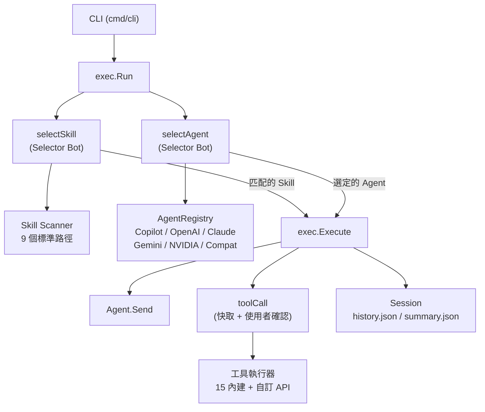

> [!NOTE]
> 此 README 由 [SKILL](https://github.com/pardnchiu/skill-readme-generate) 生成，英文版請參閱 [這裡](../README.md)。


# Agenvoy

[](https://pkg.go.dev/github.com/pardnchiu/agenvoy)
[](https://goreportcard.com/report/github.com/pardnchiu/agenvoy)
[](https://app.codecov.io/github/pardnchiu/agenvoy/tree/master)
[](LICENSE)
[](https://github.com/pardnchiu/agenvoy/releases)

> 以 Go 語言打造的 Agentic AI 平台，具備意圖導向技能路由、多 Provider LLM 派發、跨回合記憶與零程式碼 REST API 工具掛載。

## 目錄

- [功能特點](#功能特點)
- [架構](#架構)
- [檔案結構](#檔案結構)
- [授權](#授權)
- [Author](#author)
- [Stars](#stars)

## 功能特點

> `go install github.com/pardnchiu/agenvoy/cmd/cli@latest` · [完整文件](./doc.zh.md)

### 雙層路由 Agentic 執行引擎

每次執行前，輕量級 Selector Bot 執行兩項並發 LLM 路由決策：從 9 個標準路徑並發掃描的 Markdown 檔案中匹配最佳 Skill，並從 Agent Registry 選出最合適的後端。執行迴圈最多運行 16 次（一般模式）或 128 次（Skill 模式），對已執行的 Tool Call 進行快取去重，並在達到迭代上限時自動觸發摘要流程，確保始終返回連貫的最終回應。

### 零程式碼 REST API 工具掛載

框架內建 15 個工具，涵蓋檔案 I/O、網路搜尋、JS 渲染瀏覽器擷取、金融資料、天氣、精確數學運算與 Shell 指令。超出內建範圍的需求，只需在標準路徑投入單一 JSON 設定檔即可將任意 REST API 掛載為新工具，無需修改框架程式碼。認證方式（Bearer Token、API Key、Basic Auth）、請求格式、逾時與回應欄位映射均在設定檔中宣告。

### OS Keychain 憑證儲存與安全指令執行

API 金鑰儲存於 OS 原生 Keychain（macOS 使用 `security`，Linux 使用 `secret-tool`）而非環境變數，並為其他平台提供檔案型退路。`rm` 指令會被攔截並重導向至 `.Trash` 目錄而非永久刪除，防止 AI 驅動的檔案操作發生意外資料遺失。

## 架構



## 檔案結構

```
agenvoy/
├── cmd/
│   └── cli/
│       ├── main.go                  # CLI 進入點
│       ├── addProvider.go           # 互動式 Provider 設定
│       ├── getAgentRegistry.go      # 多 Provider Agent Registry 初始化
│       ├── printTool.go             # ANSI 色彩輸出工具
│       └── runEvents.go             # 事件迴圈與互動確認
├── internal/
│   ├── agents/
│   │   ├── exec/                    # 執行核心（路由、工具迴圈、Session 管理）
│   │   ├── provider/                # 6 個 AI 後端（copilot/openai/claude/gemini/nvidia/compat）
│   │   └── types/                   # 共用介面（Agent、Message、Output）
│   ├── discord/                     # 選用 Discord Bot 整合
│   ├── keychain/                    # OS Keychain 憑證儲存
│   ├── skill/                       # 並發 Skill 掃描與解析
│   ├── tools/                       # 工具執行器與 15 個內建工具
│   │   ├── apiAdapter/              # JSON 設定驅動的自訂 API 工具
│   │   ├── apis/                    # 網路 API（Finance、RSS、Weather）
│   │   ├── browser/                 # Chrome JS 渲染頁面擷取
│   │   ├── calculator/              # 精確數學運算
│   │   └── file/                    # 檔案讀寫、搜尋、歷史查詢
│   └── utils/                       # 共用工具函式
├── examples/apis/                   # 自訂 API 設定範例
├── go.mod
└── README.md
```

## 授權

本專案採用 [AGPL-3.0 LICENSE](LICENSE)。

## Author


<h4 style="padding-top: 0">邱敬幃 Pardn Chiu</h4>

<a href="mailto:dev@pardn.io" target="_blank">

</a> <a href="https://linkedin.com/in/pardnchiu" target="_blank">

</a>

## Stars

[](https://www.star-history.com/#pardnchiu/agenvoy&Date)

***

©️ 2026 [邱敬幃 Pardn Chiu](https://linkedin.com/in/pardnchiu)
